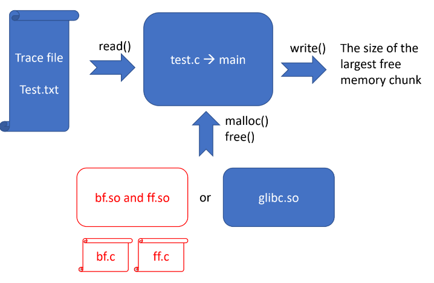
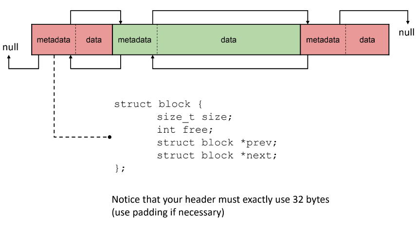
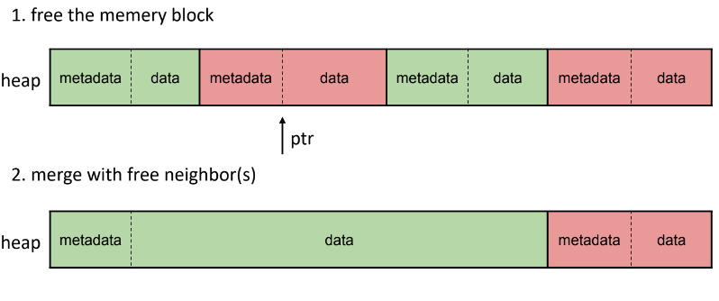

# HW4 - malloc() Replacement

## Overview
To replace the original libc implementation of malloc() and free() with your own version

To evaluate the performance of two representative space allocation algorithms, namely, Best Fit and First Fit

Provides two files
- test.txt: A input file that defines operations of memory allocation and de-allocation

- main.c: A program tha calls malloc() and free() using the operations in test.txt

You write two files
- bf.c: your malloc() and free() using BEST FIT

- ff.c: your malloc() and free() using FIRST FIT

Overview \


## Test Flow
1. Compile test.c into main and put test.txt in the same directory.
2. Run `./main`
    - Should be no problem
3. Compile bf.c and ff.c into bf.so and ff.so, respectively
4. Run `LD_PRELOAD=/path/to/your/bf.so ./main`
    - Print a result on the screen
5. Run `LD_PRELOAD=/path/to/your/ff.so ./main`
    - Print a result on the screen

## Implementation (bb.c and ff.c)
On the first malloc()
- Pre-allocate a memory pool of 20,000 bytes from the kernel using mmap()
- Initialize metadata for your memory pool

On subsequent malloc() and free()
- Process malloc() and free() within the memory pool

On malloc(0)
- A fake request that indicates end-of-test
- Print the size of the largest free chunk
- Call munmap() to release the memory pool

Layout \


## Memory Pool Management
`void *malloc(size_t size)`


`void free(void *ptr)`


## Implementation Details
Chunk list (chunk = space)
- A list manages all memory chunks, both used and free
- Initially has only one free memory chunk

The header of a chunk is of exactly 32 bytes
- Including paddings

Memory alignment
- The starting address of the memory pool must be aligned to 4 KB (this is guaranteed by mmap())
- The allocation size must be rounded to a multiple of 32

The memory address returned by malloc() must all be aligned to 32 bytes. for example:
- The starting memory address of the memory pool is 8192
- The return address of the first malloc(31) is 8192 + 32
- The return address of the second malloc() is 8192 + 32 + 32 + 32

## APIs
```c
#include <sys/mman.h>
/*** Creates a new mapping in the virtual address space of the calling process ***/
void *mmap(void *addr, size_t length, int prot, int flags, int fd, off_t offset);

/*** Deletes the mappings ***/
int munmap(void *addr, size_t length);
```

## Input and Output
Input filename: test0.txt, test1.txt or test2.txt

Input line format: [A or D] [ id ] [ size ]\n
- A: Allocate, D: Deallocate
- id: an integer identifier
- size: bytes

Output: size of the largest free space
- Format: Max Free Chunk Size = $size in bytes\n
- Excluding the header

## Note
You may notice that main.c avoids using `fopen()`, `scanf()`, and `printf()` because these APIs call `malloc()` internally and will affect your result
```c
Fopen() -> open()
Fread() -> read()
Fclose() -> close()
```

To print out a string 

Use a local variable string array 

Use `sprinf()` to format your string

Use `wrtie(stdout, **)` to output your string

